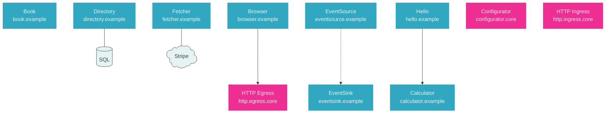

## Workflow

Copy this checklist and track your progress:

```
Chart the microservice topology:
- [ ] Step 1: Analyze project
- [ ] Step 2: Generate Mermaid diagram
```

#### Step 1: Analyze Project

Read `main/main.go` to identify the included microservices by their import paths.

Read the `manifest.yaml` of each of the included microservice to get its `name`, `hostname`, `downstream` dependencies, `db` and `cloud` properties.

#### Step 2: Generate Mermaid Diagram

Regenerate `main/topology.mmd`, a Mermaid diagram of all included microservices and the dependencies among them.

**Every** microservice added to the app in `main/main.go` must appear in the diagram — including core services, not just those that appear as downstream dependencies.

To build the diagram:
- Generate a `graph TB` diagram
- Use the `hostname` of the microservice as the node key, and `Name<br>hostname` as the node label
- Draw an edge `--->` (three dashes) from each upstream service to its downstream dependencies
- Draw a dotted edge `-..->` from each event source microservice to the event sink microservice
- Sort nodes by the reverse of the hostname (e.g. `hello.example` becomes `example.hello`) so that nodes with the same domain suffix are grouped together
- Include microservices that have no edges as standalone nodes
- If a microservice has a `db` property in its manifest, draw a `---` edge (two dashes, short) to a cylinder node `[(value)]` where `value` is the value of the `db` property. Name the cylinder node using the hostname of the microservice with a `.db` suffix
- If a microservice has a `cloud` property in its manifest, draw a `---` edge (two dashes, short) to a cloud node `@{shape: cloud, label: "value"}` where `value` is the value of the `cloud` property. Name the cloud node using the hostname of the microservice with a `.cloud` suffix
- Define the styling classes `core`, `svc` and `ext` as shown in the example below
- Assign classes using `class` statements at the end of the diagram (do NOT use inline `:::` syntax, as it is incompatible with some node shapes like cloud)
- Apply class `svc` to non-core microservice nodes
- Apply class `core` to core microservice nodes (hostnames ending in `.core`)
- Apply class `ext` to `db` cylinder nodes and `cloud` nodes

Example:


