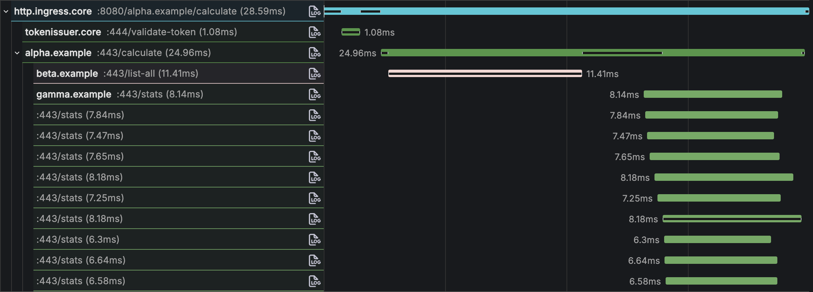
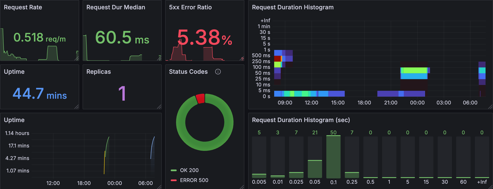

# Microbus.io

## Teach Your Agent to Code Microservices

Your coding agent can already code. Microbus teaches it to master the complex domain of distributed systems — the architecture, the patterns, the operational discipline — and produce enterprise-grade microservices, every time.

### Precise Code. Faster. At Scale.

**Precise code** - Each microservice fits entirely in your agent's context window. [Skills](./docs/blocks/agent-skills.md) guide every [feature](./docs/blocks/features.md). A single, [simple API](./docs/structure/connector.md) handles the infrastructure. Your agent codes with complete awareness and zero guesswork.

**Faster** - Agents implement, test, and iterate in one session, in one process. No containers, no external dependencies, no waiting. Tighter [dev-test-debug loops](./docs/blocks/integration-testing.md) mean fewer mistakes and faster delivery.

**At scale** - Every microservice is independent. Multiple agents — or multiple developers — work on different services simultaneously without merge conflicts or coordination overhead.

[Get started](#get-started) in minutes. `Microbus` is free and open source under the Apache 2.0 license.

## Why Microbus?

Microservices are the right architecture for most growing systems, but the conventional toolchain is daunting: container orchestration, service meshes, API gateways, distributed tracing pipelines. `Microbus` replaces that complexity with a single framework where microservices communicate over [NATS](https://nats.io) using familiar HTTP semantics.

**Performant** - Persistent multiplexed connections deliver [up to 10x the throughput of HTTP/1.1](./docs/blocks/multiplexed.md), benchmarked on a single machine to run 10,000 microservices at over 100,000 req/sec.

**Observable** - [Distributed tracing](./docs/blocks/distrib-tracing.md), [structured logging](./docs/blocks/logging.md) and [metrics](./docs/blocks/metrics.md) are built in from the start, not bolted on after the fact.

**Testable** - Spin up a full integration test of multiple microservices [in a single Go test function](./docs/blocks/integration-testing.md), with no containers or external dependencies required.

**AI-native** - Deep integration with [coding agents](./docs/blocks/coding-agents.md) lets you go from a plain-language prompt to a production-ready microservice with tests in minutes.

## Get Started

### Prerequisites

- Your favorite coding agent
- [Go](https://go.dev/) 1.24+
- [NATS](https://nats.io) messaging bus (required in high-availability production settings, optional during development)
- [LGTM stack](https://github.com/grafana/docker-otel-lgtm) OpenTelemetry observability stack (optional)

### Take a Tour

The [examples](./docs/structure/examples.md) directory contains microservices that demonstrate key patterns: [hello world](./examples/helloworld), [calculator](./examples/calculator), [CRUD with a database](./examples/directory), [events](./examples/eventsource), [authentication](./examples/login) and more.

Take the agent-guided tour!

> HEY CLAUDE...
>
> Use curl to download the workflow at https://raw.githubusercontent.com/microbus-io/fabric/refs/heads/main/setup/bootstrap.md and follow it. After that, find the appropriate skill and take me through the tour

### Build Your First Microservice

The [step-by-step tutorial](./docs/howto/first-microservice.md) walks you through creating a microservice from scratch, covering endpoints, configuration, web handlers and integration tests.

### Start a New Project

Ready to build your own solution? [Bootstrap a new project](./docs/howto/new-project.md) from scratch.

## Build with a Coding Agent

`Microbus` is designed to work hand-in-hand with coding agents like [Claude Code](https://docs.anthropic.com/en/docs/claude-code). The framework's structured project layout and embedded [guidance](./docs/blocks/coding-agents.md#how-agents-are-guided) keep the agent's context window small and its output accurate.

Ask your coding agent to bootstrap `Microbus`:

> HEY CLAUDE...
>
> Use curl to download the workflow at https://raw.githubusercontent.com/microbus-io/fabric/refs/heads/main/setup/bootstrap.md and follow it

Then prompt your way to a fully-implemented microservice:

> HEY CLAUDE...
>
> Create a new microservice "helloworld"
>
> Create a web handler that prints "Hello, World!"
>
> Create a config for the Greeting, with a default of "Hello". The greeting must start with a capital letter and not be empty
>
> Create a functional endpoint Add that sums up two integers x and y and returns the sum
>
> Fire an event OnDouble when x==y in Add
>
> Create a metric that totals the positive sums in Add, and another that totals the negative sums

Six prompts. Under 10 minutes. 819 lines of code at 87% test coverage.

Learn more about how [coding agents](./docs/blocks/coding-agents.md) work within the `Microbus` framework.

## Deploy

Bundle microservices into applications and deploy them to match your scale: as a single binary, a handful of containers, or across availability zones. Microservices communicate via a messaging bus.

## Observe

Distributed tracing, metrics and structured logging provide precision visibility into system behavior.

## Architecture

Your solution is built on top of [5 layers](./docs/blocks/layers.md) of powerful technologies that together form a robust foundation:

**OSS** - A curated selection of proven technologies — [NATS](https://nats.io) for messaging, [OpenTelemetry](https://opentelemetry.io) for observability, [Grafana](https://grafana.com) for visualization — abstracted away by the layers above.

**Connector** - The [`Connector`](./docs/structure/connector.md) is the base construct from which all microservices are derived. It provides a consistent API for transport, observability, configuration and lifecycle management.

**Coding agents** - [Coding agents](./docs/blocks/coding-agents.md) generate boilerplate, business logic, tests and documentation using embedded [skills](./docs/blocks/agent-skills.md) that guide each feature end to end.

**Microservices** - [Core microservices](./docs/structure/coreservices.md) ship with the framework. Solution microservices implement your business logic. Both are built the same way using the same tools.

**Applications** - Microservices are bundled into [applications](./docs/structure/application.md) according to the desired [topology](./docs/blocks/topology.md) — a single binary, a handful of containers, or across availability zones.

## Features

### Transport
| | |
|---|---|
| [Unicast](./docs/blocks/unicast.md) | 1:1 request/response between microservices |
| [Multicast](./docs/blocks/multicast.md) | 1:N publish/subscribe |
| [Multiplexed connections](./docs/blocks/multiplexed.md) | Persistent connections with up to 10x HTTP/1.1 throughput |
| [Service discovery](./docs/blocks/discovery.md) | Dynamic, no registry required |
| [Load balancing](./docs/blocks/lb.md) | Automatic distribution across replicas |
| [Time budget](./docs/blocks/time-budget.md) | Cascading timeout propagation |
| [Ack or fail fast](./docs/blocks/ack-or-fail.md) | Immediate feedback on request delivery |
| [Locality-aware routing](./docs/blocks/locality-aware-routing.md) | Prefer co-located replicas |
| [Connectivity check](./docs/blocks/connectivity-liveness-test.md) | Liveness detection |
| [Short-circuit](./docs/tech/short-circuit.md) | In-memory transport for co-located services |

### Observability
| | |
|---|---|
| [Distributed tracing](./docs/blocks/distrib-tracing.md) | Cross-service call visualization via OpenTelemetry |
| [Structured logging](./docs/blocks/logging.md) | JSON logging to stderr |
| [Metrics](./docs/blocks/metrics.md) | Prometheus-compatible metrics |
| [Error capture](./docs/blocks/error-capture.md) | Stack traces preserved across service boundaries |

### Developer Experience
| | |
|---|---|
| [Client stubs](./docs/blocks/client-stubs.md) | Type-safe generated clients |
| [Integration testing](./docs/blocks/integration-testing.md) | Multi-service tests in a single process |
| [Static resources](./docs/blocks/embedded-res.md) | Embedded files via go:embed |
| [Events](./docs/blocks/events.md) | Decouple services with event-driven patterns |
| [Tickers](./docs/blocks/tickers.md) | Recurring scheduled jobs |

### Robust Runtime
| | |
|---|---|
| [Configuration](./docs/blocks/configuration.md) | Centralized YAML-based config |
| [Authorization](./docs/blocks/authorization.md) | JWT-based access control |
| [Adaptable topology](./docs/blocks/topology.md) | Monolith, multi-container, or hybrid |
| [OpenAPI](./docs/blocks/openapi.md) | Auto-generated API documentation |
| [Distributed caching](./docs/blocks/distrib-cache.md) | Shared cache across replicas |
| [Graceful shutdown](./docs/blocks/graceful-shutdown.md) | Drain pending operations before termination |

## Documentation

### Guides

- [Quick start](./docs/howto/quick-start.md) - An agent-guided tour of the examples
- [First microservice](./docs/howto/first-microservice.md) - Build a microservice step by step
- [Coding agents](./docs/blocks/coding-agents.md) - Leverage AI-assisted development
- [New project](./docs/howto/new-project.md) - Bootstrap a solution from scratch
- [New microservice](./docs/howto/create-microservice.md) - Add a microservice to your project
- [Configuration](./docs/blocks/configuration.md) - Configure microservices
- [Integration testing](./docs/blocks/integration-testing.md) - Test multiple microservices together
- [Enabling authorization](./docs/howto/enabling-auth.md) - Set up JWT-based access control

### Reference

- [Features of a microservice](./docs/blocks/features.md) - Endpoints, events, configs, tickers and metrics
- [Path arguments](./docs/tech/path-arguments.md) - Wildcard and greedy path parameters
- [HTTP magic arguments](./docs/tech/http-arguments.md) - Fine-grained control over HTTP request/response
- [Environment variables](./docs/tech/envars.md) - Initialization settings
- [NATS connection](./docs/tech/nats-connection.md) - Connection and authentication options
- [Control subscriptions](./docs/tech/control-subs.md) - Built-in management endpoints
- [Deployment environments](./docs/tech/deployments.md) - PROD, LAB, LOCAL and TESTING modes
- [Ports](./docs/tech/ports.md) - External and internal ports
- [RPC over JSON vs REST](./docs/tech/rpc-vs-rest.md) - API style comparison
- [Local development](./docs/tech/local-dev.md) - Running a full solution in your IDE
- [Package catalog](./docs/structure/packages.md) - Introduction to `Microbus`'s codebase

### Design

- [Encapsulation pattern](./docs/tech/encapsulation.md) - Why third-party technologies are wrapped
- [JSON/HTTP vs Protobuf](./docs/tech/json-vs-protobuf.md) - Protocol choice rationale
- [Out of scope](./docs/tech/out-of-scope.md) - Deliberate boundaries
- [Milestones](./docs/general/milestones.md) - Project history and evolution
- [Mission statement](./docs/general/mission-statement.md) - Goals and philosophy

## Get Involved

We want your feedback. Clone the repo, try things out and let us know what worked for you, what didn't and what you'd like to see improved.

Help us spread the word. Let your peers and the Go community know about `Microbus`.

Give us a Github star.

Reach out if you'd like to contribute code.

Corporation? Contact us for sponsorship opportunities.

## Contact

| <nobr>Find us at...</nobr> | |
|------------|-----|
| Website    | [www.microbus.io](https://www.microbus.io) |
| Email      | info@microbus.io |
| Github     | [github.com/microbus-io](https://www.github.com/microbus-io) |
| LinkedIn   | [linkedin.com/company/microbus-io](https://www.linkedin.com/company/microbus-io) |
| Discord    | [discord.gg/FAJHnGkNqJ](https://discord.gg/FAJHnGkNqJ) |
| Reddit     | [r/microbus](https://reddit.com/r/microbus) |
| YouTube    | [@microbus-io](https://www.youtube.com/@microbus-io) |

## Legal

The `Microbus` framework is the copyrighted work of various contributors. It is licensed to you free of charge by `Microbus LLC` - a Delaware limited liability company formed to hold rights to the combined intellectual property of all contributors - under the [Apache License 2.0](http://www.apache.org/licenses/LICENSE-2.0).

Refer to the list of [third-party open source software](./ATTRIBUTION.md) for licensing information of components used by the `Microbus` framework.
