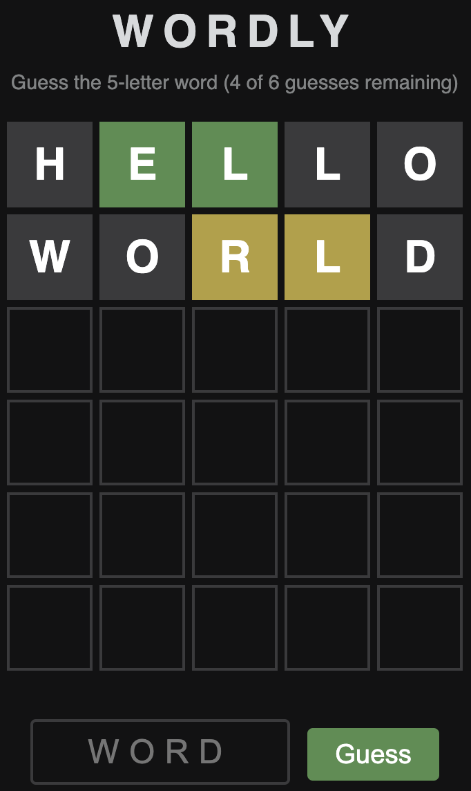

# First Microservice Walkthrough

This guide walks through the creation of a microservice that implements a simplified version of a word guessing game. The player needs to reveal a secret 5-letter word by entering a limited number of guesses while observing how closely they match the secret word.

For example, if the secret word is `APPLE` and a guess is `OPERA`, the system will identify the second letter `P` as an exact match (green), the letters `A` and `E` as out-of-place matches (yellow), and the letters `O` and `R` as mismatches (grey).


<p></p>

Microbus uses a coding agent (e.g. Claude Code) to scaffold microservices from natural-language prompts. In this walk-through we'll show the 2 prompts needed to build the `Wordly` microservice.

### Prompt 1: Create the Microservice

> HEY CLAUDE...
>
> Create a new microservice "Wordly" for a word guessing game. Use the hostname "wordly.example". Be quick about it.

The agent will use a skill to create the directory structure and boilerplate files.

```
wordly
├── resources
│   └── embed.go
├── wordlyapi
│   └── client.go
├── AGENTS.md
├── CLAUDE.md
├── PROMPTS.md
├── intermediate.go
├── manifest.yaml
├── mock.go
├── service.go
└── service_test.go
```

### Prompt 2: Implement the Endpoint

> HEY CLAUDE...
>
> Create a web endpoint called Guess that allows the user to guess a 5-letter word. The game gives color-coded feedback: green if a letter matches the secret word in the same position, yellow if a letter is in the secret word but at a different position, and grey otherwise. The user has a maximum number of guesses that is configurable with config property "MaxGuesses" (default to 6). At the end of the game, show the secret word and allow starting a new game. Store a list of 5-letter dictionary words in a resource file (words.txt) and randomly choose one as the secret word for each game. Game state is stored in a base64-encoded cookie. Be quick about it.

### Time to Play!

Run the app using `go run` or your IDE.

```shell
cd main
go run main.go
```

Go to http://localhost:8080/wordly.example/guess and enjoy!


<p></p>

Want to make the game harder by decreasing the number of guesses? Change the value of the config property `MaxGuesses` by editing `config.yaml` in the root of the project.

```yaml
wordly.example:
  MaxGuesses: 5
```
