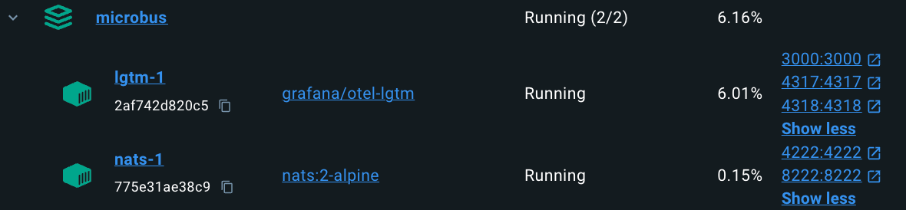

# Quick Start

### Clone the Project

Fetch the code:

```cmd
mkdir github.com/microbus-io
cd github.com/microbus-io
git clone https://github.com/microbus-io/fabric
```

### Setup and Run the Development Environment

The `Microbus` framework depends on a couple of third-party technologies:

* [NATS](https://nats.io) is a hard requirement used as the transport of communication among microservices
* [Grafana](https://grafana.com/) LGTM is an optional component that can collect and visualize telemetry generated by the microservices

To quickly set up the above, use Docker Compose from within the `setup` directory to install NATS and [Grafana LGTM](https://grafana.com/blog/2024/03/13/an-opentelemetry-backend-in-a-docker-image-introducing-grafana/otel-lgtm/) in containers.

```cmd
cd setup
docker compose -f microbus.yaml -p microbus up -d
```

Docker Desktop should now show the `microbus` application:

<br>

Note that Docker is not mandatory. You can install the dependencies manually, inside or outside containers.

### Run the Examples

Run the example app:

```cmd
cd main
go run main.go
```

It is necessary to set the working directory to `main` so that the file `main/config.yaml` can be located.

If you're using Visual Studio Code, simply press `F5`. The `.vscode/launch.json` file includes a launch configuration for running `main`.

Try the following URLs in your browser:

* http://localhost:8080/calculator.example/arithmetic?x=5&op=*&y=8
* http://localhost:8080/calculator.example/square?x=5
* http://localhost:8080/calculator.example/square?x=not-a-number
* http://localhost:8080/calculator.example/distance?p1.x=0&p1.y=0&p2.x=3&p2.y=4
* http://localhost:8080/hello.example/echo
* http://localhost:8080/hello.example/ping
* http://localhost:8080/hello.example/hello?name=Bella
* http://localhost:8080/hello.example/calculator
* http://localhost:8080/hello.example/bus.png
* http://localhost:8080/messaging.example/home
* http://localhost:8080/messaging.example/cache-store?key=foo&value=bar
* http://localhost:8080/messaging.example/cache-load?key=foo
* http://localhost:8080/browser.example/browse?url=example.com
* http://localhost:8080/directory.example/web-ui?method=POST&path=/persons&body=%7B%22firstName%22:%22Harry%22,%22lastName%22:%22Potter%22,%22email%22:%22hp@hogwarts.edu%22%7D (push submit to perform the POST request)
* http://localhost:8080/directory.example/persons
* http://localhost:8080/directory.example/persons/key/1
* http://localhost:8080/directory.example/web-ui?method=DELETE&path=/persons/key/1 (push submit to perform the DELETE request)
* http://localhost:8080/login.example/welcome

Feel free to experiment with different values for the query parameters.

View the telemetry collected by Grafana at http://localhost:3000. Metrics and traces are visualized in [dashboards](http://localhost:3000/dashboards) and can also be viewed in the [metrics drill-down app](http://localhost:3000/a/grafana-metricsdrilldown-app) and the [traces drill-down app](http://localhost:3000/a/grafana-exploretraces-app).

### Configure IDE

The [Todo Tree extension](https://marketplace.visualstudio.com/items?itemName=Gruntfuggly.todo-tree) is recommended for VS Code users.
