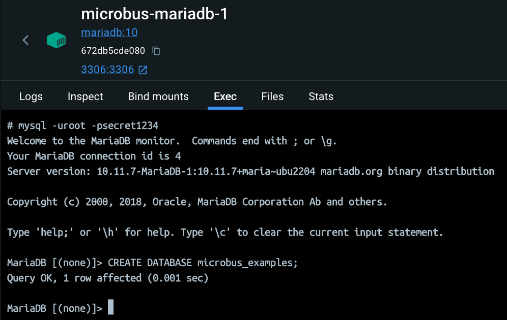
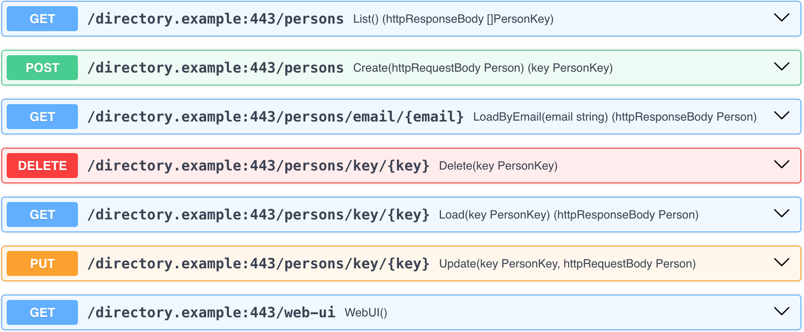

# Package `examples/directory`

The `directory.example` microservice is an example of a microservice that provides a RESTful CRUD API backed by a SQL database.
For the sake of this example, if a connection to the SQL database cannot be established, the microservice emulates a database in-memory.

### Adding SQL Support

It takes a couple of steps to add SQL support to a microservice.

> HEY CLAUDE...
>
Define a configuration property "SQL" to represent the data source name.

> HEY CLAUDE...
>
> Open a SQL database connection for the life of the microservice. Take the connection string from the "SQL" property.

### Connecting to the Database

This example requires a MariaDB database instance. If you don't already have one installed, you can add it to Docker using:

```shell
docker pull mariadb
docker run -p 3306:3306 --name mariadb-1 -e MARIADB_ROOT_PASSWORD=root -d mariadb
```

Next, create a database named `microbus_examples`.

From the `Exec` panel of the `mariadb-1` container, type:

```shell
mysql -uroot -proot
```

And then use the SQL command prompt to create the database:

```sql
CREATE DATABASE microbus_examples;
```


<p></p>

Set the connection string to the database in `config.local.yaml` at the root of the project.

```yaml
directory.example:
  SQL: "root:root@tcp(127.0.0.1:3306)/microbus_examples"
```

### Web UI

The directory microservice uses a RESTful API style rather than RPC over JSON. A RESTful API leverage HTTP methods other than just `GET`, which are impossible to call directly from the browser's address bar. To circumvent this restriction, the microservice includes a web endpoint called `WebUI` that provides a simple browser-like form that supports `GET`, `POST`, `PUT` and `DELETE`.

Open the web UI at http://localhost:8080/directory.example/web-ui

To create a new person in the directory `POST` to `/persons`:

```json
{
    "email": "harry.potter@hogwarts.edu.wiz",
    "firstName": "Harry",
    "lastName": "Potter"
}
```

The server will respond with the new user's key:

```json
{
    "key": 1
}
```

Oops, we forgot to enter Harry's birthday! To update a record `PUT` to `/persons/key/1` (assuming that key 1 was assigned to Harry):

```json
{
    "email": "harry.potter@hogwarts.edu.wiz",
    "firstName": "Harry",
    "lastName": "Potter",
    "birthday": "1980-07-31"
}
```

To list all persons in the directory `GET` from `/persons`. The server will respond with an array of keys:

```json
[
    1
]
```

To load a record, `GET` from `/persons/key/1` (by key) or `/persons/email/harry.potter@hogwarts.edu.wiz` (by email). The server will respond with the record:

```json
{
    "birthday": "1980-07-31T00:00:00Z",
    "email": "harry.potter@hogwarts.edu.wiz",
    "firstName": "Harry",
    "key": 1,
    "lastName": "Potter"
}
```

To delete a record, `DELETE` at `/persons/key/1`. Voldemort would be pleased.

### OpenAPI

Alternatively, use the OpenAPI document of the microservice to interact with the directory microservice. Fetch the OpenAPI document at:

http://localhost:8080/directory.example/openapi.json

Copy the JSON and paste it at https://editor-next.swagger.io to parse it. You'll see all endpoints of the microservices listed to the right-hand side.


<p></p>

Click on any of them to expand. Press the `Try it out` button, enter the appropriate data, and `Execute`.
